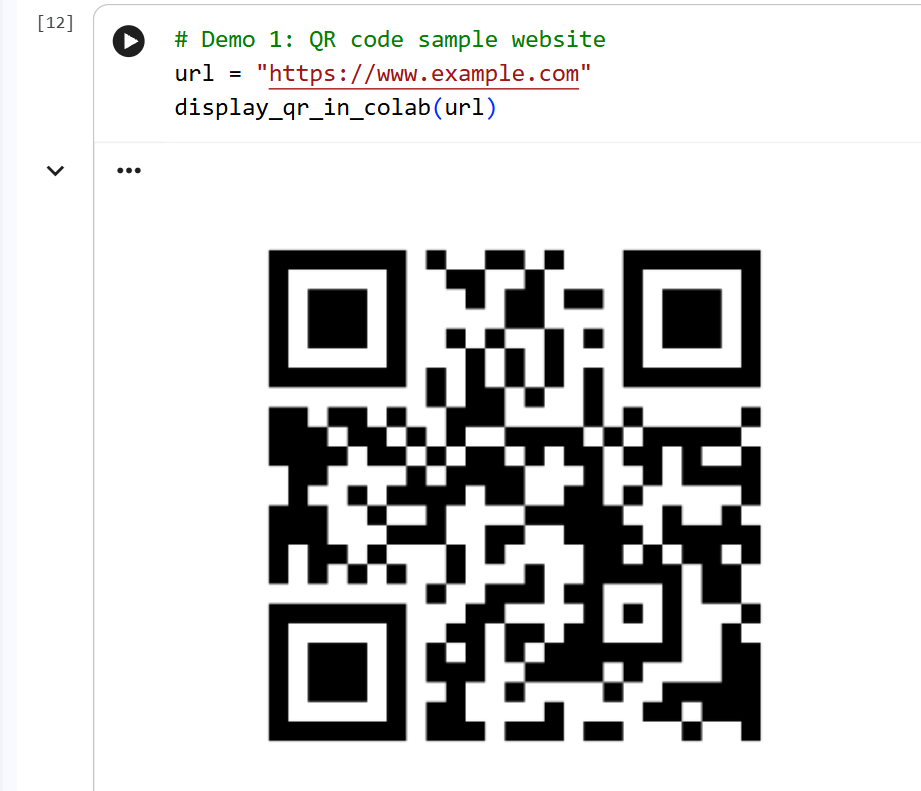
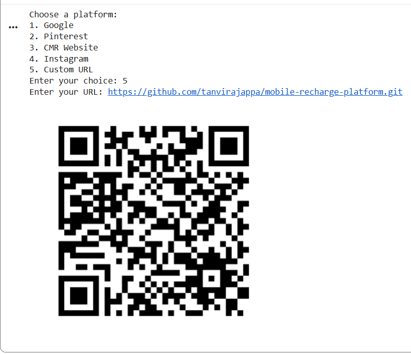
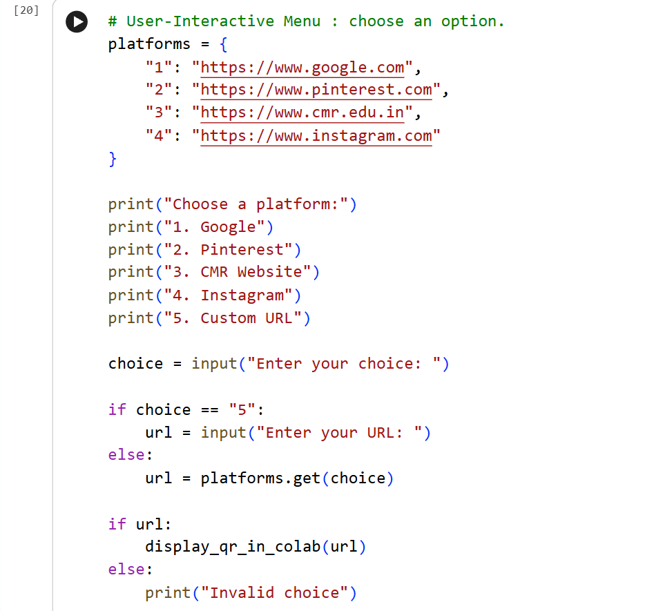
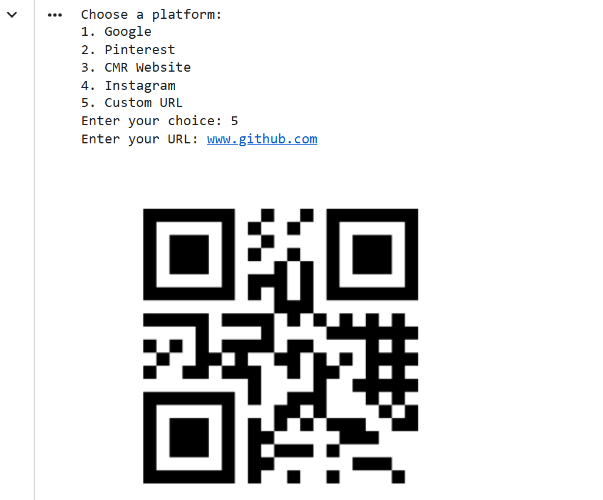

# link2QR
link2QR is a Python-based tool built using Google Colab that converts website and platform links into scannable QR codes. The purpose of this project is to simplify link sharing and accessibility by enabling users to generate QR codes for websites and online platforms, allowing quicker access through a simple scan instead of manually sharing long URLs.

---

## Features

- Generate QR codes for any URL or popular platforms like Google, Pinterest, Instagram, and more.
- Visualize QR codes directly in Google Colab using Matplotlib.
- User-friendly menu-based input to select predefined platforms or enter custom URLs.
- Works instantly and generates scannable, live QR codes that redirect to real websites.

---

## Demo

```python
# Example usage
url = "https://www.example.com"
display_qr_in_colab(url)
```

## Screenshots

### Demo QR Code


Example: QR generated for my Mobile Recharge Platform repository


### Menu Input




## How to Use
- Run the notebook in Google Colab.
- Choose a platform from the menu or enter a custom URL.
- A QR code will be displayed which can be scanned with any QR scanner.

## Technologies Used
- Python
- Google Colab
- qrcode library
- Matplotlib for visualization

## Author
Tanvi Rajappa
